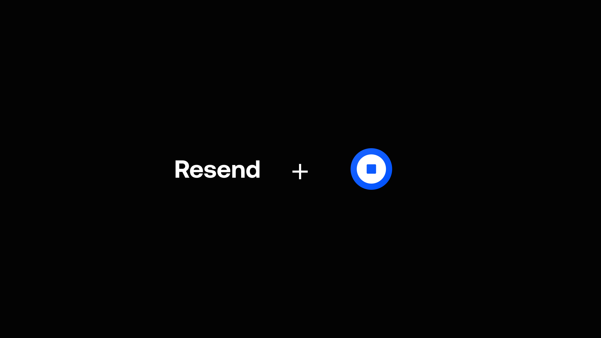

# Smart Wallet + Resend Demo



This demo showcases the integration of [Smart Wallet](https://smartwallet.dev) and [Resend](https://resend.com) to create a seamless user authentication experience. It demonstrates how to:

- Authenticate users with passkeys
- Collect user emails during the authentication process
- Utilize Smart Wallet for secure, user-friendly authentication
- Leverage Resend for efficient email communication

**Disclaimer:** This project is built by [@fkxpls](https://x.com/fkpxls) and is not officially associated with Coinbase.

## Features

- Passkey-based authentication
- Email collection alongside authentication
- Integration with Smart Wallet and Resend APIs

## Getting Started

### Prerequisites

Ensure you have the following:

1. API key from [Coinbase Developer Portal's OnchainKit page](https://portal.cdp.coinbase.com/products/onchainkit)
2. Project ID from [Wallet Connect](https://cloud.walletconnect.com)
3. API key and Audience ID from [Resend](https://resend.com/docs/api-reference/introduction)

### Setup

1. Clone this repository
2. Copy `.local.env.example` to `.env` and fill in your API keys:

```sh
NEXT_PUBLIC_CDP_API_KEY="YOUR_COINBASE_API_KEY"
NEXT_PUBLIC_WC_PROJECT_ID="YOUR_WALLET_CONNECT_PROJECT_ID"
RESEND_API_KEY="YOUR_RESEND_API_KEY"
RESEND_AUDIENCE_ID="YOUR_RESEND_AUDIENCE_ID"
```

### Run the App

```sh
# Install bun in case you don't have it
bun curl -fsSL <https://bun.sh/install> | bash

# Install packages
bun i

# Run Next app
bun run dev
```

## Resources

- This app is built with [OnchainKit](https://onchainkit.xyz)

## License

This project is licensed under the MIT License - see the [LICENSE.md](LICENSE.md) file for details